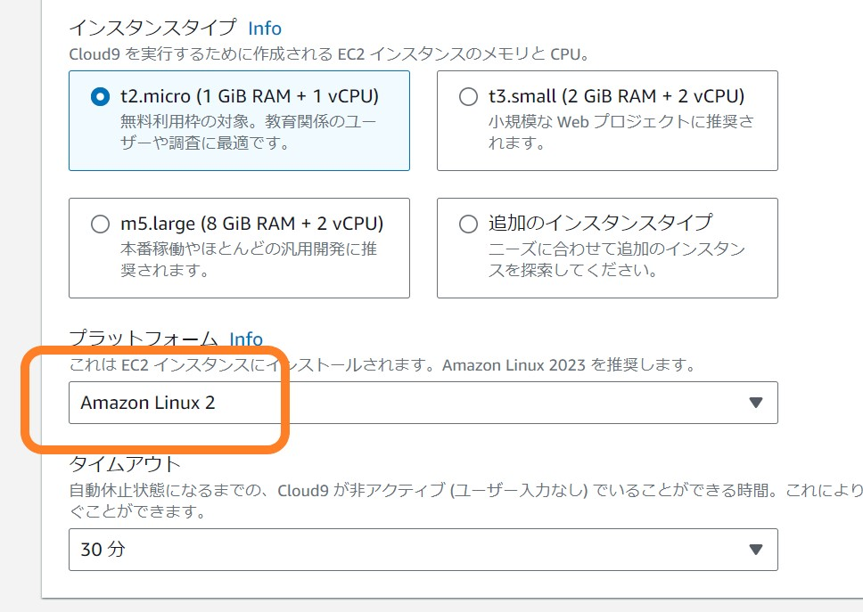
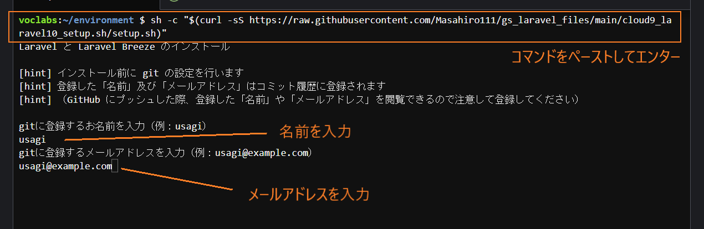

# G's ACADEMY - Cloud9 Laravel10 自動セットアップスクリプトの使い方

Cloud9 で Laravel10 を自動セットアップするスクリプトを使用しています。

今回の実行する Laravel10 のセットアップスクリプトは、**Amazon Linux 2** で動作することを前提としたスクリプトとなっています。Cloud9 で環境を作成する際に以下のように **Amazon Linux 2** を選択してから作成ボタンをクリックしてください。



Cloud9 の環境を作成した後に、Cloud9 の IDE を立ち上げてコンソールに「~/environment $」という表示になっていることを確認してください。以下のコマンドをコピーして、そのままコンソールに貼り付けしてエンターキーを押してください。

```command
sh -c "$(curl -sS https://raw.githubusercontent.com/Masahiro111/gs_laravel_files/main/cloud9_laravel10_setup.sh/setup.sh)"
```

すると以下の画像のような画面がされます。Git 設定のための「名前」を入力してエンター、続けてメールアドレスの入力をしてエンターを押してください。自動的に Laravel 10 のインストールを開始します。



Laravel 10 のインストールが完了すると再度コマンドの入力待ちになりますので、続けて `cd cms` コマンドで、Laravel のプロジェクトフォルダに移動してから `php artisan serve --port=8080` コマンドでサーバーを立ち上げてください。

この時点ですでにデータベースの作成は完了しています。また phpMyAdmin にアクセスしてデータベースの参照を行うこともできます。

認証パッケージの Laravel Breeze もインストール済みなので、試しにトップページの右上にある「Register」をクリックしてユーザー情報を入力してみましょう。

ユーザー登録後に、ダッシュボードページに遷移したら正常に動作していると思います。

それからは、ジーズのラーニングシステムにある Laravel 動画の GitHub のリンクにあるテキストの 271 行目付近「**データ構造を作成（テーブル作成）**」から勉強を開始することができると思います。
